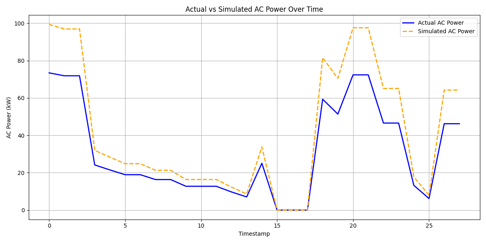
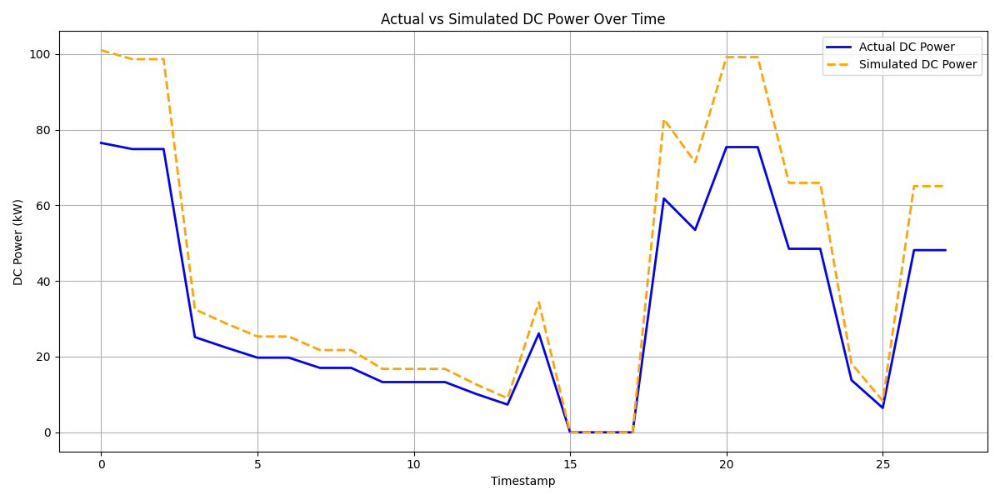
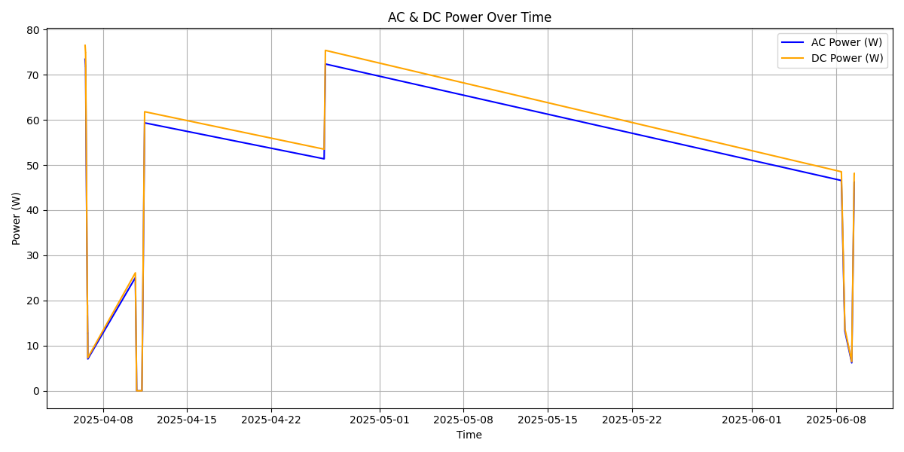
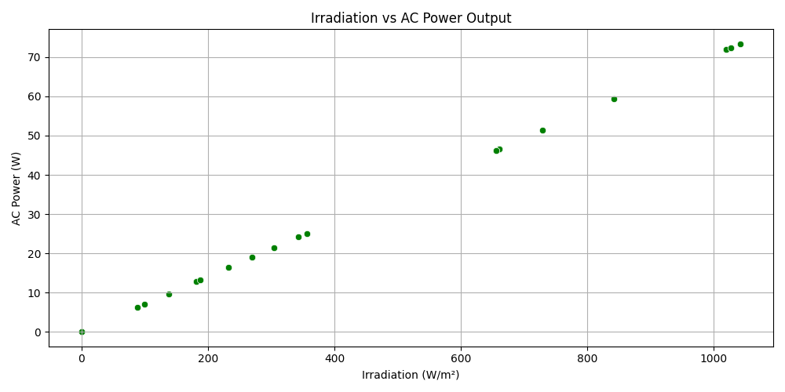
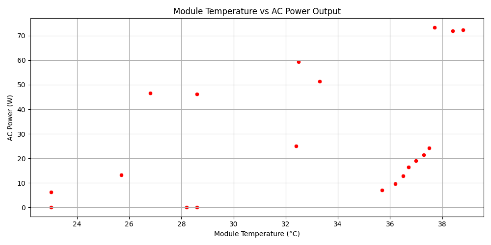
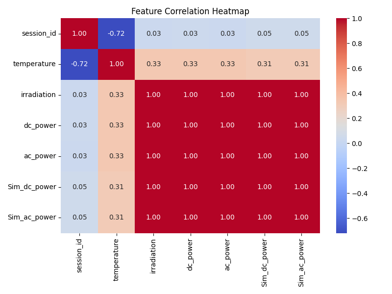

# Solar_DT

> Solar_DT — data tools and simulations for PV array fault detection and analysis.

## Overview

Solar_DT contains scripts and data used to fetch solar measurements, run simulations, and detect faults in PV arrays. This repository includes utilities for data extraction, preprocessing, running Simulink-related artifacts, and basic visualization.

## Features

- Fetch and store solar measurement data
- Run simulation inputs and convert outputs to CSV/MAT formats
- Basic fault detection and visualization tools

## Requirements

- Python 3.8+ recommended
- See `requirements.txt` for Python dependencies
- MATLAB Runtime (if using Simulink artifacts) — see `requiredMCRProducts.txt` and `includedSupportPackages.txt`

## Quick start

1. Create and activate a virtual environment:

```powershell
python -m venv .venv
.\.venv\Scripts\Activate.ps1
```

2. Install Python dependencies:

```powershell
pip install -r requirements.txt
```

3. Fetch data (example):

```powershell
python fetch_solar_data.py
```

4. Run the main workflow or analysis:

```powershell
python main.py
```

## Important files

- `main.py` — entry point for the main workflow
- `fetch_solar_data.py` — download or assemble solar data
- `ETL.py` — data extraction / transformation / loading helpers
- `Fault_Detection.py` — routines to detect anomalies/faults
- `visualizer.py` — plotting and visualization helpers
- `requirements.txt` — Python package dependencies
- `matlab.mat`, `sim_output.mat`, `sim_input.csv` — example/auxiliary data and simulation artifacts

## Data

The repository contains sample data files (e.g. `solar_data.csv`, `sim_input.csv`) and outputs (e.g. `sim_output.mat`, `final_output.csv`). If you have large datasets, keep them out of the repository and point scripts to their local paths.

## Notes on Simulink / MATLAB files

This project includes Simulink project artifacts and compiled acceleration files under `slprj/`. Running Simulink models requires MATLAB/Simulink or the MATLAB Runtime for generated binaries. See the included support files for platform details.

## System Architecture

The repository orchestration is implemented in `main.py`. A system architecture diagram is provided as `PVGrid.svg` (vector). It shows how data flows from sources through fetching and simulation, into the ETL pipeline, then into analytics, fault detection, and visualization.

If you need a raster `PVGrid.png`, convert the SVG locally with ImageMagick or Inkscape:

```powershell
# ImageMagick
magick PVGrid.svg PVGrid.png

# or Inkscape
inkscape PVGrid.svg --export-filename=PVGrid.png
```

The key pipeline from `main.py` is:

- `fetch_solar_data.py` → generates raw solar inputs
- Simulink `PVArrayGrid.slx` (run via MATLAB `sim`) → `sim_to_csv` exports
- `ETL.py` merges and creates `merged_by_session.csv`
- `arima.py` runs `train_sarima(...)`
- `Fault_Detection.py` runs `detect_faults(...)` → `faults_detected.csv`
- `visualizer.py` produces dashboards/plots and `final_output.csv`

## Graphs / Outputs

The `graphs/` folder contains example visual outputs produced by `visualizer.py` and analysis steps. Preview images are embedded below:













## Development

- Follow the Quick start to set up a venv and install `requirements.txt`.
- Add or update data files under a data directory (not tracked if large).
- When modifying scripts that call MATLAB/Simulink, verify your MATLAB Runtime version matches the generated artifacts.

